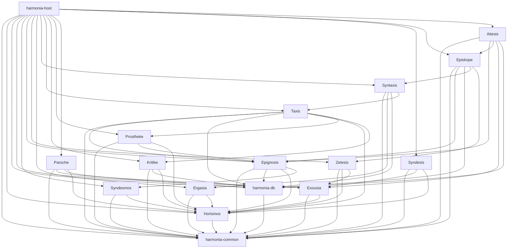

# Cargo Workspace Layout

> The Rust workspace structure for Harmonia's backend.
> This is the code-level expression of the subsystem map in [subsystems.md](subsystems.md).
> Subsystem identities are in [naming/registry.md](../naming/registry.md).
> The dependency DAG this layout must match is in [naming/topology.md](../naming/topology.md).

## Purpose

This document specifies the Rust workspace structure for Harmonia's backend rewrite. Every crate name corresponds to a subsystem defined in `docs/architecture/subsystems.md`. Every dependency edge in the crate graph must match the DAG in `docs/naming/topology.md`. Deviations between this document and the topology DAG are errors — the DAG is law.

The C# code in `harmonia/mouseion/` is retained as reference material. The Rust workspace root is `harmonia/` — at the top of the monorepo, not inside `mouseion/`. The virtual manifest contains no `[package]` section.

---

## Workspace Root

```
harmonia/                       # Workspace root — virtual manifest only
├── Cargo.toml                  # [workspace] only — no [package]
├── Cargo.lock
├── harmonia.toml               # Runtime config (committed with safe defaults, no secrets)
├── secrets.toml                # Secret overrides — gitignored, never committed
├── crates/
│   ├── harmonia-common/        # Shared newtypes, enums, Aggelia event types
│   ├── horismos/               # Configuration (leaf — no internal deps)
│   ├── harmonia-db/            # SQLite layer — dual pools, migrations, typed queries (depends on harmonia-common)
│   ├── exousia/                # Auth (depends on harmonia-common, horismos)
│   ├── syndesmos/              # External API connector (depends on harmonia-common, horismos)
│   ├── epignosis/              # Metadata (depends on harmonia-common, harmonia-db, horismos, syndesmos)
│   ├── zetesis/                # Indexer search (depends on harmonia-common, horismos, exousia)
│   ├── ergasia/                # Download execution (depends on harmonia-common, horismos)
│   ├── syntaxis/               # Queue + pipeline (depends on harmonia-common, ergasia, harmonia-db, taxis)
│   ├── taxis/                  # Import + organize (depends on harmonia-common, epignosis, harmonia-db, horismos, kritike, prostheke)
│   ├── kritike/                # Curation + quality (depends on harmonia-common, harmonia-db, horismos)
│   ├── prostheke/              # Subtitles (depends on harmonia-common, epignosis, horismos)
│   ├── paroche/                # Media serving (depends on harmonia-common, exousia, harmonia-db, horismos)
│   ├── syndesis/               # QUIC streaming — renderer transport, multi-room sync (depends on harmonia-common, exousia, horismos)
│   ├── episkope/               # Monitoring (depends on harmonia-common, epignosis, harmonia-db, syntaxis, zetesis)
│   ├── aitesis/                # Requests (depends on harmonia-common, epignosis, episkope, exousia, harmonia-db)
│   └── harmonia-host/          # Binary — entry point, assembles all crates
├── docs/
│   └── architecture/           # This file and subsystems.md
└── mouseion/                   # C# reference material — not part of Rust workspace
```

---

## Crate Inventory

All 17 crates: 16 library crates + 1 binary. Every library crate maps 1:1 to a subsystem from `docs/architecture/subsystems.md`.

| Crate | Type | Directory | Key Public Exports | Crate Dependencies |
|-------|------|-----------|--------------------|-------------------|
| **harmonia-common** | lib | `crates/harmonia-common/` | `MediaId`, `UserId`, `DownloadId`, `MediaType`, `QualityProfile`, `HarmoniaEvent` enum, `PathBuf` newtypes | None (leaf) |
| **horismos** | lib | `crates/horismos/` | `Config`, `SubsystemConfig`, `fn load_config() -> Result<Config>` | harmonia-common |
| **harmonia-db** | lib | `crates/harmonia-db/` | `DbPools`, `init_pools()`, typed query functions, migration runner | harmonia-common |
| **exousia** | lib | `crates/exousia/` | `AuthService` trait, `Claims`, `UserRole`, `ApiKey`, `RefreshToken` | harmonia-common, horismos |
| **syndesmos** | lib | `crates/syndesmos/` | `PlexClient`, `LastfmClient`, `TidalClient`, `ExternalSyncService` trait | harmonia-common, horismos |
| **epignosis** | lib | `crates/epignosis/` | `MetadataService` trait, `Metadata`, `MediaIdentity` | harmonia-common, harmonia-db, horismos, syndesmos |
| **zetesis** | lib | `crates/zetesis/` | `IndexerService` trait, `SearchQuery`, `SearchResult` | harmonia-common, horismos, exousia |
| **ergasia** | lib | `crates/ergasia/` | `DownloadService` trait, `DownloadSpec`, `DownloadProgress` | harmonia-common, horismos |
| **syntaxis** | lib | `crates/syntaxis/` | `QueueService` trait, `QueueItem`, `QueueSnapshot` | harmonia-common, ergasia, harmonia-db, taxis |
| **taxis** | lib | `crates/taxis/` | `ImportService` trait, `LibraryItem`, `CompletedDownload` | harmonia-common, epignosis, harmonia-db, horismos, kritike, prostheke |
| **kritike** | lib | `crates/kritike/` | `CurationService` trait, `QualityAssessment`, `HealthReport` | harmonia-common, harmonia-db, horismos |
| **prostheke** | lib | `crates/prostheke/` | `SubtitleService` trait, `SubtitleTrack`, `SubtitleLanguage` | harmonia-common, epignosis, horismos |
| **paroche** | lib | `crates/paroche/` | `StreamService` trait, `StreamResponse`, `OpdsFeed` | harmonia-common, exousia, harmonia-db, horismos |
| **syndesis** | lib | `crates/syndesis/` | `RendererService` trait, `RendererConn`, `ClockSync`, `JitterBuffer` | harmonia-common, exousia, horismos |
| **episkope** | lib | `crates/episkope/` | `MonitoringService` trait, `WantedItem`, `MediaIdentity` | harmonia-common, epignosis, harmonia-db, syntaxis, zetesis |
| **aitesis** | lib | `crates/aitesis/` | `RequestService` trait, `Request`, `RequestStatus` | harmonia-common, epignosis, episkope, exousia, harmonia-db |
| **harmonia-host** | bin | `crates/harmonia-host/` | `main()` — assembles all subsystems, owns Aggelia channel lifecycle; four execution modes (`serve`, `desktop`, `render`, `play`) selected via Clap subcommand — see [binary-modes.md](binary-modes.md) | All 16 library crates |

**Note on harmonia-common:** Aggelia event types (`HarmoniaEvent` enum and channel handle types) live in `crates/harmonia-common/src/aggelia/`. This is the shared leaf crate — all other crates already depend on it. The Aggelia broadcast channel itself is created in harmonia-host at startup and distributed as `Sender`/`Receiver` handles via constructor injection. No subsystem imports Aggelia as a separate crate.

---

## Dependency Graph

Mermaid DAG showing crate-level dependencies. Arrows point in the direction of dependency (A depends on B). Matches `docs/naming/topology.md` exactly.



**No circular dependencies.** The graph is a DAG — verified by inspection against `docs/naming/topology.md`. harmonia-common is the only true leaf (no internal deps). horismos and harmonia-db are the next layer (depend only on harmonia-common). harmonia-host is the only assembler.

---

## Workspace Cargo.toml Specification

```toml
# harmonia/Cargo.toml — virtual manifest
[workspace]
resolver = "3"  # Rust 2024 edition feature resolver
members = [
    "crates/harmonia-common",
    "crates/horismos",
    "crates/harmonia-db",
    "crates/exousia",
    "crates/syndesmos",
    "crates/epignosis",
    "crates/zetesis",
    "crates/ergasia",
    "crates/syntaxis",
    "crates/taxis",
    "crates/kritike",
    "crates/prostheke",
    "crates/paroche",
    "crates/syndesis",
    "crates/episkope",
    "crates/aitesis",
    "crates/harmonia-host",
]

[workspace.package]
version = "0.1.0"
edition = "2024"
license = "GPL-3.0-or-later"

[workspace.dependencies]
# Internal crates — path-referenced so workspace members can use .workspace = true
harmonia-common = { path = "crates/harmonia-common" }
horismos          = { path = "crates/horismos" }
harmonia-db       = { path = "crates/harmonia-db" }
exousia           = { path = "crates/exousia" }
syndesmos         = { path = "crates/syndesmos" }
epignosis         = { path = "crates/epignosis" }
zetesis           = { path = "crates/zetesis" }
ergasia           = { path = "crates/ergasia" }
syntaxis          = { path = "crates/syntaxis" }
taxis             = { path = "crates/taxis" }
kritike           = { path = "crates/kritike" }
prostheke         = { path = "crates/prostheke" }
paroche           = { path = "crates/paroche" }
syndesis          = { path = "crates/syndesis" }
episkope          = { path = "crates/episkope" }
aitesis           = { path = "crates/aitesis" }

# External shared dependencies
figment       = { version = "0.10", features = ["toml", "env"] }
snafu         = { version = "0.8", features = ["rust_1_65"] }
tokio         = { version = "1", features = ["full"] }
serde         = { version = "1", features = ["derive"] }
tracing       = "0.1"
jsonwebtoken  = "10"
prefixed-api-key = "0.3"
argon2        = "0.5"
rand          = "0.9"
```

**`resolver = "3"`:** The Rust 2024 edition feature resolver. Required for correct feature flag propagation across the workspace, especially for the optional integration features (`plex`, `lastfm`, `tidal`, `usenet`).

---

## Per-Crate Cargo.toml Pattern

Individual crate Cargo.toml files inherit version, edition, and license from the workspace. All shared external dependencies are declared with `.workspace = true`.

**Template (zetesis as the concrete example):**

```toml
# crates/zetesis/Cargo.toml
[package]
name = "zetesis"
version.workspace = true
edition.workspace = true
license.workspace = true

[dependencies]
harmonia-common.workspace = true
horismos.workspace = true
exousia.workspace = true
snafu.workspace = true
tokio.workspace = true
serde.workspace = true
tracing.workspace = true
# zetesis-specific: HTTP client for indexer queries
reqwest = { version = "0.12", features = ["json"] }
```

**Rules for per-crate Cargo.toml:**

1. Never redeclare `version`, `edition`, or `license` — use `.workspace = true` for all three.
2. Declare only the internal crates the subsystem actually depends on. Do not pull in transitive dependencies directly.
3. Shared external dependencies (figment, snafu, tokio, serde, tracing, etc.) always use `.workspace = true`.
4. Crate-specific external dependencies (reqwest, sqlx-specific features, etc.) are declared locally with pinned versions.
5. Library crates declare `[lib]` implicitly — no `[[bin]]` sections unless the crate is a binary.

---

## Feature Flags

Feature flags gate optional integrations. All feature flags are declared in `harmonia-host/Cargo.toml` — they are workspace-level integration switches, not per-library toggles.

| Feature | Crate Gated | What It Enables |
|---------|-------------|-----------------|
| `plex` | syndesmos | Plex library sync notifications, collection management, viewing statistics |
| `lastfm` | syndesmos | Last.fm scrobbling and artist metadata supply to Epignosis |
| `tidal` | syndesmos | Tidal discovery data, want-list sync to Episkope |
| `usenet` | ergasia | Usenet download support via NZBGet/SABnzbd (BitTorrent remains default) |

**Declaration in `harmonia-host/Cargo.toml`:**

```toml
[features]
default = []
plex    = ["syndesmos/plex"]
lastfm  = ["syndesmos/lastfm"]
tidal   = ["syndesmos/tidal"]
usenet  = ["ergasia/usenet"]
```

**Declaration in subsystem crates (example — syndesmos):**

```toml
# crates/syndesmos/Cargo.toml
[features]
plex   = []
lastfm = []
tidal  = []
```

**Usage in subsystem code:**

```rust
// crates/syndesmos/src/lib.rs
#[cfg(feature = "plex")]
pub mod plex;

#[cfg(feature = "lastfm")]
pub mod lastfm;
```

Feature flags never affect the core Rust type system or trait definitions — only integration-specific modules are gated. The `PlexClient`, `LastfmClient`, and `TidalClient` types exist only when their respective feature flag is active.

---

## Anti-Patterns

**Circular dependencies.** The DAG from `docs/naming/topology.md` is law. If adding a dependency would create a cycle, the design is wrong. `cargo check` will catch this, but the structural error exists before the compiler sees it.

**Cross-subsystem internal type imports.** Subsystem crates must not import another subsystem's internal types directly (bypassing trait boundaries). Cross-subsystem type sharing goes through `harmonia-common`. If two subsystems need to share a type, that type belongs in harmonia-common.

**`async-trait` crate.** Native `async fn` in traits is stable since Rust 1.75. Zero use of the `async-trait` proc-macro crate. Mandated by `.claude/rules/rust.md`.

**`thiserror` in new crates.** New Mouseion crates use `snafu` only. `thiserror` may appear in pre-existing Akroasis code — this is a pre-existing inconsistency, not a pattern to extend. Mandated by `.claude/rules/rust.md`.

**`once_cell` or `lazy_static`.** Use `std::sync::LazyLock` (stable since Rust 1.80). Mandated by `.claude/rules/rust.md`.

**Secrets in `harmonia.toml`.** The committed config file must never contain JWT signing keys, API key seeds, or password hashes. These belong in `secrets.toml` (gitignored) or in `HARMONIA__{SUBSYSTEM}__{KEY}` environment variables. Horismos must validate at startup that secret fields are not the compiled-in default values.

**`harmonia-host` as a library.** The host crate is a binary. It wires subsystems together, creates the Aggelia broadcast channel, distributes handles, and starts the Tokio runtime. It is not a library and should not expose a public API surface.
