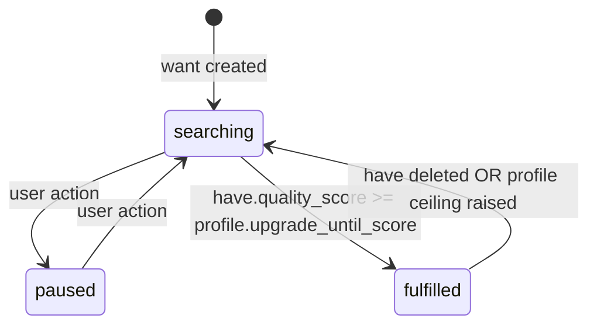

# Want / Release / Have

> Three-state acquisition lifecycle for all media types in Harmonia.
> Related: [entity-registry.md](entity-registry.md), [quality-profiles.md](quality-profiles.md), [architecture/subsystems.md](../architecture/subsystems.md)

## The Three States

```
Want (user desires) --[system finds]--> Release (exists in wild) --[system downloads]--> Have (on disk)
```

- **Want** — the intent to acquire a media item. Created by the user (manually), a Tidal sync, an RSS feed, or an approved household request. A want persists until fulfilled or deleted. It carries a quality profile that defines the acceptable floor and upgrade ceiling.
- **Release** — a specific edition or format found by Zetesis when searching indexers. Multiple releases can match one want; each is evaluated independently against the want's quality profile. A release is ephemeral — it represents a download candidate, not owned content.
- **Have** — an imported, organized file on disk. Represents actual library content. A have is created by Taxis on successful import. A want can accumulate multiple haves over time as upgrades arrive; only the latest counts toward fulfillment.

---

## `wants` Table

```sql
CREATE TABLE wants (
    id                 BLOB NOT NULL PRIMARY KEY,
    media_type         TEXT NOT NULL CHECK(media_type IN (
                           'music_album', 'audiobook', 'book', 'comic',
                           'podcast', 'movie', 'tv_series'
                       )),
    title              TEXT NOT NULL,
    registry_id        BLOB REFERENCES media_registry(id),
    quality_profile_id INTEGER NOT NULL REFERENCES quality_profiles(id),
    status             TEXT NOT NULL DEFAULT 'searching' CHECK(status IN (
                           'searching', 'paused', 'fulfilled'
                       )),
    source             TEXT CHECK(source IN (
                           'manual', 'tidal_sync', 'request', 'rss_feed'
                       )),
    source_ref         TEXT,
    added_at           TEXT NOT NULL DEFAULT (strftime('%Y-%m-%dT%H:%M:%SZ', 'now')),
    fulfilled_at       TEXT
);

CREATE INDEX idx_wants_type_status ON wants(media_type, status);
CREATE INDEX idx_wants_registry ON wants(registry_id);
```

| Column | Type | Notes |
|--------|------|-------|
| `id` | `BLOB NOT NULL PRIMARY KEY` | UUIDv7, 16-byte BLOB. |
| `media_type` | `TEXT NOT NULL` | Constrained to seven values. Determines which per-type table the fulfilled have references. |
| `title` | `TEXT NOT NULL` | Human-readable title for display in the UI. Not a canonical identifier. |
| `registry_id` | `BLOB` | NULLABLE. A want can exist before identity is resolved. Epignosis fills this in asynchronously after the want is created. |
| `quality_profile_id` | `INTEGER NOT NULL` | FK to `quality_profiles(id)`. Determines floor, ceiling, and upgrade behaviour. |
| `status` | `TEXT NOT NULL` | Three-state FSM: `searching`, `paused`, `fulfilled`. Default is `searching`. |
| `source` | `TEXT` | Origin of the want. NULL means unknown or pre-attribution. `tidal_sync` is set when TidalWantListSynced fires. |
| `source_ref` | `TEXT` | External ID from the source system. Tidal album ID, request UUID, RSS feed item GUID. |
| `added_at` | `TEXT NOT NULL` | ISO8601 UTC. Set on insert. |
| `fulfilled_at` | `TEXT` | ISO8601 UTC. Set when status transitions to `fulfilled`. NULL while searching or paused. |

The `idx_wants_type_status` index supports the primary search loop query: "find all searching wants of type X." The `idx_wants_registry` index supports identity-based lookup: "given a resolved registry entity, find the matching want."

---

## `releases` Table

```sql
CREATE TABLE releases (
    id                  BLOB NOT NULL PRIMARY KEY,
    want_id             BLOB NOT NULL REFERENCES wants(id) ON DELETE CASCADE,
    indexer_id          INTEGER NOT NULL,
    title               TEXT NOT NULL,
    size_bytes          INTEGER NOT NULL,
    quality_score       INTEGER NOT NULL,
    custom_format_score INTEGER NOT NULL DEFAULT 0,
    download_url        TEXT NOT NULL,
    protocol            TEXT NOT NULL CHECK(protocol IN ('torrent', 'nzb')),
    info_hash           TEXT,
    found_at            TEXT NOT NULL DEFAULT (strftime('%Y-%m-%dT%H:%M:%SZ', 'now')),
    grabbed_at          TEXT,
    rejected_reason     TEXT
);

CREATE INDEX idx_releases_want ON releases(want_id);
CREATE INDEX idx_releases_info_hash ON releases(info_hash);
```

| Column | Type | Notes |
|--------|------|-------|
| `id` | `BLOB NOT NULL PRIMARY KEY` | UUIDv7. |
| `want_id` | `BLOB NOT NULL` | FK to `wants(id)`. CASCADE on delete — releases are meaningless without a want. |
| `indexer_id` | `INTEGER NOT NULL` | Which indexer found this release. FK to the indexer registry defined in Phase 5. No FK constraint here to avoid a forward dependency. |
| `title` | `TEXT NOT NULL` | Release title as reported by the indexer. Used for custom format matching. |
| `size_bytes` | `INTEGER NOT NULL` | Total download size. |
| `quality_score` | `INTEGER NOT NULL` | Base score from the rank table for this release's format. |
| `custom_format_score` | `INTEGER NOT NULL` | Additive score from custom format rules. May be negative. Default 0. |
| `download_url` | `TEXT NOT NULL` | Torrent file URL or NZB download URL. |
| `protocol` | `TEXT NOT NULL` | `torrent` or `nzb`. |
| `info_hash` | `TEXT` | Torrent info hash. NULL for NZB releases. Used for deduplication. |
| `found_at` | `TEXT NOT NULL` | When Zetesis found this release. |
| `grabbed_at` | `TEXT` | When Syntaxis triggered the download. NULL until grabbed. |
| `rejected_reason` | `TEXT` | Human-readable rejection cause if Episkope evaluated and rejected this release. NULL if not yet evaluated or if accepted. |

The `idx_releases_info_hash` index supports deduplication: before grabbing a torrent, check whether a release with the same info hash was already grabbed for any want.

---

## `haves` Table

```sql
CREATE TABLE haves (
    id               BLOB NOT NULL PRIMARY KEY,
    want_id          BLOB NOT NULL REFERENCES wants(id),
    release_id       BLOB REFERENCES releases(id),
    media_type       TEXT NOT NULL,
    media_type_id    BLOB NOT NULL,
    quality_score    INTEGER NOT NULL,
    file_path        TEXT NOT NULL,
    file_size_bytes  INTEGER NOT NULL,
    status           TEXT NOT NULL DEFAULT 'pending' CHECK(status IN (
                         'pending', 'downloading', 'importing', 'complete', 'failed'
                     )),
    imported_at      TEXT NOT NULL DEFAULT (strftime('%Y-%m-%dT%H:%M:%SZ', 'now')),
    upgraded_from_id BLOB REFERENCES haves(id)
);

CREATE INDEX idx_haves_want ON haves(want_id);
CREATE INDEX idx_haves_type_id ON haves(media_type, media_type_id);
CREATE UNIQUE INDEX idx_haves_file_path ON haves(file_path);
```

| Column | Type | Notes |
|--------|------|-------|
| `id` | `BLOB NOT NULL PRIMARY KEY` | UUIDv7. |
| `want_id` | `BLOB NOT NULL` | FK to `wants(id)`. A have always originates from a want. |
| `release_id` | `BLOB` | NULLABLE. NULL for manually imported items that bypassed the release pipeline. |
| `media_type` | `TEXT NOT NULL` | Mirrors `wants.media_type` for the per-type table lookup. |
| `media_type_id` | `BLOB NOT NULL` | Soft FK to the per-type table's primary key. See note below. |
| `quality_score` | `INTEGER NOT NULL` | Score from the rank table for this file's format. Used by Kritike for upgrade evaluation. |
| `file_path` | `TEXT NOT NULL` | Absolute path on disk. Must be unique — no two haves share a file. |
| `file_size_bytes` | `INTEGER NOT NULL` | Actual file size at import time. |
| `status` | `TEXT NOT NULL` | Five-state FSM: `pending` (have row created, download not yet complete), `downloading` (Syntaxis is transferring), `importing` (Taxis is organizing and tagging), `complete` (on disk and indexed), `failed` (import failed; have row retained for diagnostics). Default is `pending`. |
| `imported_at` | `TEXT NOT NULL` | When Taxis completed the import and created this record. |
| `upgraded_from_id` | `BLOB` | NULLABLE. If this have is an upgrade, points to the previous have it replaced. Creates an upgrade chain. |

**Soft FK on `media_type_id`:** The `media_type_id` column does not carry a SQL `REFERENCES` clause. Its target table changes depending on `media_type`: for `music_album` it references `music_release_groups(id)`; for `movie` it references `movies(id)`; and so on. SQL cannot express a single FK to multiple tables. The application layer (Taxis, Kritike) enforces referential integrity. This is the one deliberate concession to the cross-type nature of the lifecycle tables — every other FK in these three tables is enforced by SQLite.

---

## State Machine



### State Definitions

| Status | Meaning | Search Activity |
|--------|---------|----------------|
| `searching` | Active. System periodically queries indexers for matching releases. Default state on creation. If a have already exists below the ceiling, the system continues searching for upgrades. | Yes |
| `paused` | User manually paused. No searches run. All state is preserved; resume returns to `searching` without losing existing releases or haves. | No |
| `fulfilled` | A have exists that meets or exceeds `profile.upgrade_until_score`. Terminal state — no further searches until user action. | No |

### Transition Rules

| Transition | Trigger | Actor |
|------------|---------|-------|
| `searching` → `paused` | User pauses the want | User action via Episkope |
| `paused` → `searching` | User resumes the want | User action via Episkope |
| `searching` → `fulfilled` | `have.quality_score >= profile.upgrade_until_score` | Automatic — Kritike emits `QualityUpgradeTriggered`, Episkope updates status |
| `fulfilled` → `searching` | Have is deleted OR `profile.upgrade_until_score` is raised above current have's score | Automatic — Episkope rechecks on mutation |

**Upgrade-while-searching:** A want in `searching` status may already have a have. The system continues searching until the have meets the ceiling. This is intentional: the user specified a quality ceiling, and the system honours it automatically.

---

## Quality Gate at Download

When Episkope evaluates a candidate release for handoff to Syntaxis:

```
total_score = release.quality_score + release.custom_format_score

1. total_score < profile.min_quality_score         → REJECT (below floor)
2. release.custom_format_score < profile.min_custom_format_score → REJECT (custom format floor)
3. No existing have                                 → ACCEPT (first acquisition)
4. profile.upgrades_allowed = 0                    → SKIP (upgrades disabled)
5. existing_have.quality_score >= profile.upgrade_until_score  → SKIP (ceiling met)
6. total_score <= existing_have.quality_score       → SKIP (no improvement)
7. Otherwise                                        → ACCEPT (quality upgrade)
```

`REJECT` records the `rejected_reason` on the release row. `SKIP` when the ceiling is met causes Episkope to mark the want `fulfilled`. See `quality-profiles.md` for the full evaluation algorithm with pseudocode.

---

## Podcast Exception

Podcast subscriptions do not use the want/release/have lifecycle. A `podcast_subscriptions` row auto-downloads new episodes from the feed without the search-evaluate-grab pipeline. The want lifecycle applies to individual podcast episodes only if the user explicitly creates a want for a specific episode.

The `podcast_subscriptions` table and `podcast_episodes` table are defined in `media-schemas.md`. The `wants.media_type` CHECK constraint does not include `podcast_subscription` — there is no concept of "wanting" a subscription feed in the same way as an album or film.

---

## Subsystem Interaction Map

| Subsystem | Role | Operation |
|-----------|------|-----------|
| Episkope | Want manager | Creates and manages wants. Evaluates releases against quality profiles. Calls `mark_fulfilled` when ceiling met. Handles `paused`/`searching` transitions. |
| Kritike | Quality enforcer | Reads `have.quality_score` against the active profile. Emits `QualityUpgradeTriggered` when a better have arrives. |
| Taxis | Importer | Creates `haves` rows on successful import. Sets `quality_score` from the rank table. Sets `upgraded_from_id` when replacing an existing have. |
| Syntaxis | Download manager | Reads `releases` to determine download priority. Sets `grabbed_at` when download is triggered. |
| Zetesis | Indexer searcher | Creates `releases` rows for each candidate found. Sets `found_at`, `quality_score`, `info_hash`. |
| Aitesis | Request handler | Creates wants with `source='request'`. Sets `source_ref` to the request UUID. |
| Syndesmos | Tidal integration | Creates wants with `source='tidal_sync'` in response to `TidalWantListSynced` event. Sets `source_ref` to the Tidal album ID. |
