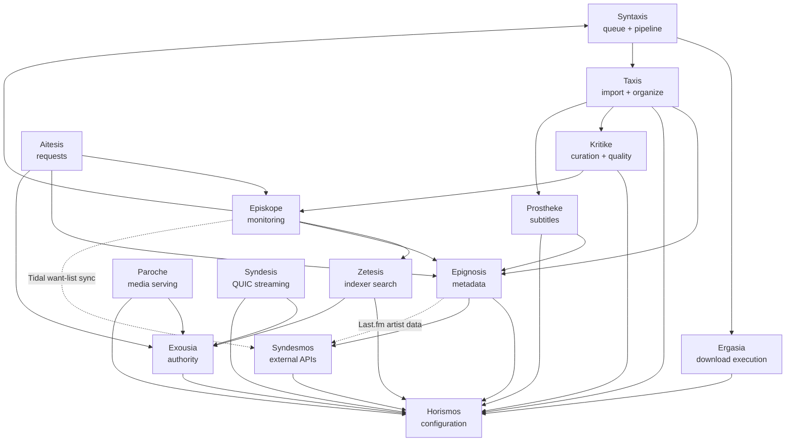
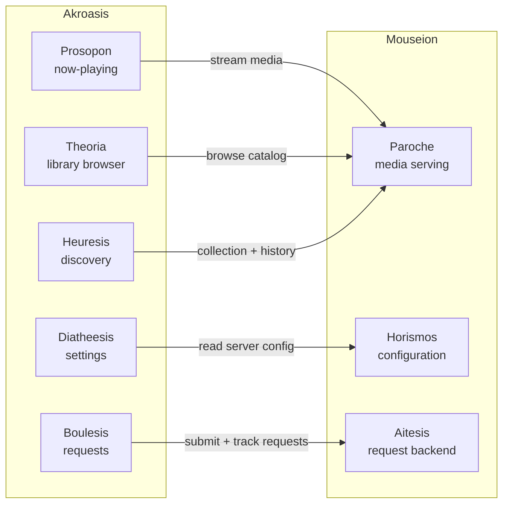

# Subsystem Topology

> How Harmonia's subsystems relate — containment, dependencies, and external boundaries.
> Names defined in [registry.md](registry.md). Naming methodology in [gnomon.md](../gnomon.md).

## Containment View

Harmonia is the fitting-together of two components: Mouseion (custodianship of collected arts) and Akroasis (attentive reception). This containment is not organizational convenience — it is the claim that a unified media platform requires both sides of the collection-listening act. Neither suffices alone.

**Mouseion** contains 15 backend subsystems that divide the full media lifecycle by functional domain:

- *Monitoring and acquisition:* Episkope, Zetesis, Ergasia, Syntaxis — the pipeline from watching for wanted media through finding, downloading, and coordinating it
- *Recognition and organization:* Epignosis, Taxis — enriching media with precise metadata, then arranging it into its proper place in the library
- *Quality and supplements:* Kritike, Prostheke — assessing library health and quality, adding subtitle tracks alongside organized media
- *Serving:* Paroche, Syndesis — Paroche delivers via HTTP to clients; Syndesis binds native renderers for QUIC audio transport and multi-room clock sync
- *Household interface:* Aitesis — receiving and processing what household members want
- *Cross-cutting foundations:* Horismos, Exousia, Aggelia — configuration as the ground on which all subsystems stand, authority as the gate through which all protected operations pass, and announcements as the nervous system that carries past-tense facts between subsystems without coupling emitter to subscriber
- *External connections:* Syndesmos — the single ligament connecting Harmonia to external API services

**Akroasis** contains 5 front-end domains covering the full player surface:

- *Playback:* Prosopon — the face of the listening act, the now-playing interface
- *Survey:* Theoria — beholding the full collection, browsing and search
- *Discovery:* Heuresis — finding what you didn't know was there
- *Requesting:* Boulesis — forming and submitting deliberate requests for wanted media
- *Configuration:* Diatheesis — arranging the player to suit the listener's character

The containment principle from gnomon.md holds throughout: being inside Mouseion means being a concern of media backend custodianship; being inside Akroasis means being a concern of attentive media reception. Syndesmos is inside Mouseion because external API integration is a backend concern — the frontend never holds external credentials or retry logic directly.

---

## Dependency Graph

Arrows point in the direction of dependency (A calls B). No circular references — the graph is a directed acyclic graph (DAG).

**Key architectural properties:**

- **Horismos and Exousia** are the only leaf dependencies (they call nothing within Mouseion). Every other subsystem reaches through them for configuration and authorization. harmonia-db is also a leaf — it provides the database layer but has no subsystem dependencies.
- **Paroche and Syndesis** are parallel serving layers — Paroche for HTTP clients, Syndesis for native renderers via QUIC. Both depend only on Exousia and Horismos.
- **Kritike → Episkope** is the only upward feedback edge: when Kritike determines an upgrade is needed, it re-enters the acquisition pipeline via Episkope. This is intentional — quality upgrades use the same acquisition path as initial acquisition.
- **Syndesmos** receives calls from Epignosis (for Last.fm data) and from Episkope (for Tidal sync). Shown as dotted lines because these are data-supply flows rather than control-flow calls.
- **Aggelia is not shown as a node in this DAG** because it is not a dependency — it is a communication channel. Subsystems receive Aggelia handles (`broadcast::Sender`/`Receiver<HarmoniaEvent>`) via constructor injection from harmonia-host at startup, not by importing a crate. Aggelia's types live in harmonia-common (which all crates already depend on); the channel itself is not a crate import. Showing Aggelia as a node would imply a crate dependency relationship that does not exist. See `docs/architecture/subsystems.md` for the full event classification.

---

## External Boundary

Harmonia connects to external services through two subsystems:

### Zetesis — Indexer Queries

Zetesis reaches outward to indexer endpoints using Torznab/Newznab protocols. It handles:

- **Torznab/Newznab indexers** — the primary search interface for torrent availability
- **Cloudflare bypass sidecar** — a separate process (e.g., FlareSolverr) that Zetesis calls when indexers require browser-challenge bypass

Zetesis holds all indexer credentials. No other subsystem touches indexer endpoints. This is the acquisition-facing external boundary.

### Syndesmos — External API Services

Syndesmos is the single connection point for all external platform integrations:

| External Service | What Syndesmos Does |
|-----------------|---------------------|
| **Plex** | Library sync notifications on import, collection management via Kometa-equivalent logic, viewing statistics |
| **Last.fm** | Artist metadata supply to Epignosis, scrobbling of listening activity |
| **Tidal** | Discovery data, want-list sync to Episkope |

Syndesmos holds all external API credentials and enforces rate limits and retry logic. No other backend subsystem holds external API state. This is the integration-facing external boundary.

### Metadata Providers — Epignosis

Epignosis reaches external metadata providers directly for enrichment data:

| Provider | Media Type |
|----------|-----------|
| MusicBrainz | Music (albums, artists, recordings) |
| TMDB | Movies, TV series |
| TVDB | TV series |
| Audnexus | Audiobooks (author, narrator, chapter data) |

These are read-only enrichment calls — Epignosis never writes to external providers. Rate limiting and credential management for these providers lives within Epignosis.

**Boundary summary:** The external surface has three gates — Zetesis (indexers), Syndesmos (platform integrations), and Epignosis (metadata providers). All other subsystems are internal. Phase 5, 6, and 7 design documents will specify the API contracts for each gate.

---

## Front-End Containment

Akroasis front-end domains connect to Mouseion backend subsystems through a defined set of call paths. Each domain has a distinct backend counterpart.

**Domain-to-backend mapping:**

| Akroasis Domain | Backend Counterpart | Relationship |
|-----------------|--------------------|-----------  |
| Prosopon | Paroche | Streams media; reads playback state |
| Theoria | Paroche | Reads catalog data (artists, albums, media items) |
| Heuresis | Paroche | Reads collection and listening history for recommendations |
| Boulesis | Aitesis | Submits requests, tracks status and history |
| Diatheesis | Horismos | Reads server-side configuration surfaced to the client |

**Intra-Akroasis dependencies:**

- Prosopon calls Theoria (to navigate to an album/track from the now-playing context)
- Theoria calls Prosopon (to initiate playback from the library browser)
- Heuresis calls Theoria (to navigate to a discovered item) and Boulesis (to request an unowned item)
- Boulesis calls Theoria (to browse before requesting)

Diatheesis is a leaf within Akroasis — other domains read its state but it does not call them.
